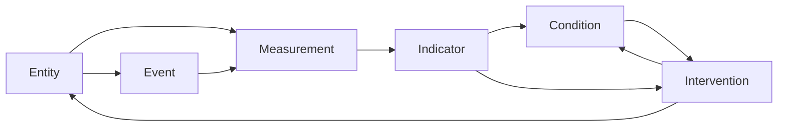

# RESCO: Reduced Set City Ontology

**An open-source, practitioner-first ontology for interoperable urban data, city monitoring, and cross-city learning.**

[](LICENSE)
[](RESCO.jsonld)

**RESCO (Reduced Set City Ontology)** is a lightweight, extensible semantic model for representing and monitoring urban systems using six core concepts: **Entity, Measurement, Indicator, Condition, Event, and Intervention**.

RESCO is designed for practitioners, researchers, and developers who need to integrate heterogeneous urban data, reproduce analytical workflows across cities, or build monitoring systems without first adopting an exhaustive model of everything that can exist in a city.

> **RESCO does not try to standardize the city. It standardizes enough of the language we use to observe one.**

**Quick links:** [Specification](RESCO.jsonld) · [Research Paper](https://papers.ssrn.com/sol3/papers.cfm?abstract_id=7376919) · [Blog Post](https://vibraniumdb.com/research/resco) · [City examples](resco_examples/) · [Citation](citation.cff) · [Changelog](CHANGELOG.md) · [License](LICENSE)

---

## Why RESCO?

Cities increasingly generate data about transportation, water, energy, environmental quality, infrastructure, housing, logistics, and public services. The challenge is often not the absence of data, but the lack of a shared structure through which different datasets, systems, and jurisdictions can understand one another.

A transport agency and an electricity utility may represent similar ideas—assets, observations, system conditions, events, or interventions—in entirely different ways. Researchers working across jurisdictions may spend substantial effort translating schemas before they can reproduce an analysis. A monitoring workflow built for one city may therefore be difficult to transfer to another even when the underlying analytical question is similar.

RESCO starts from a deliberately narrow question:

> **What is the smallest useful semantic structure through which many different things a city measures, experiences, and acts on can be represented consistently?**

The goal is not to eliminate local differences. It is to provide a stable semantic core from which those differences can be expressed.

This supports five practical objectives:

- **Interoperability** - provide shared semantics across heterogeneous urban datasets and systems.
- **Reusability** - allow data models and analytical patterns to be reused across projects and jurisdictions.
- **Reproducibility** — make the structure behind urban analyses easier to inspect and reproduce.
- **Replicability** — make it easier to test comparable workflows, indicators, and interventions in other cities.
- **System-wide monitoring** — connect observations, interpreted system state, events, and actions in a common model.

---

## The six core classes

RESCO uses six core classes to provide a small but expressive grammar for urban monitoring.

| Class | Practical question | Definition | Examples |
|---|---|---|---|
| **Entity** | What are we observing? | A generic object of interest, including a system, asset, sensor, organization, or other relevant entity. | Bus, dam, substation, air-quality sensor, port, city department |
| **Measurement** | What did we observe? | A recorded observation with a value, unit, and time. | PM2.5 reading, reservoir level, voltage, temperature, vehicle count |
| **Indicator** | What do the observations tell us? | A derived or aggregated measure based on one or more measurements. | Air Quality Index, average trip duration, total grid load, port turnaround time |
| **Condition** | What state is something in? | A qualitative or categorical state associated with an entity, event, measurement, or indicator. | Operational, under maintenance, congested, good air quality |
| **Event** | What happened? | A discrete occurrence involving or affecting one or more entities. | Train trip, ship arrival, outage, disruption, restoration |
| **Intervention** | What did we do about it? | An action intended to change an entity or system state, informed by measurements, indicators, and/or conditions. | Rerouting service, changing a schedule, repair action, operational adjustment |

A useful way to read the model is as an operational loop:



In plain language:

**What are we observing? → What did we measure? → What does it tell us? → What state is the system in? → What happened? → What did we do about it?**

The inclusion of **Intervention** is intentional. RESCO is designed not only to represent observations, but also to connect the state of an urban system to actions intended to change that state and, where available, to the outcomes that follow.

---

## Design philosophy: a reduced set

RESCO is designed around three principles:

### 1. Minimalism with completeness

The core ontology should contain enough semantic structure to support meaningful monitoring and interoperability without requiring practitioners to learn or implement an exhaustive city model.

### 2. Reusability and extensibility

The core should remain stable while practitioners can extend it for particular domains, jurisdictions, institutions, or analytical needs.

### 3. Alignment and interoperability

RESCO should remain conceptually compatible with established semantic standards rather than creating an isolated vocabulary.

### The RISC analogy

One way we describe the design philosophy is by analogy with **RISC** computer architectures.

The analogy is philosophical rather than computational: instead of placing a very large number of predefined concepts into the core, RESCO begins with a small set of primitives that can be composed and extended as the application becomes more specific.

```text
Comprehensive vocabulary approach
        ↓
Define many domain concepts upfront
        ↓
Broad predefined model


RESCO reduced-set approach
        ↓
Six stable core concepts
        ↓
Compose + extend
        ↓
Domain- and jurisdiction-specific models
```

This means that RESCO is **less a catalogue of what cities should measure than a grammar for describing what cities do measure—and what they choose to do about it.**

The reduced-set approach also reflects a systems principle associated with Gall's Law: begin with a simple system that works, then allow complexity to emerge through extension rather than trying to anticipate the entire system in advance.

---

## Open World Assumption

Urban data is frequently incomplete, distributed, and uneven across jurisdictions. One city may observe a measurement that another does not. A particular utility may maintain information that is unavailable to other agencies. New sensors, systems, and use cases will continue to emerge.

RESCO therefore follows an **Open World Assumption (OWA)**: information that is not present is treated as unknown rather than automatically false.

This makes the ontology suitable for:

- fragmented or federated data environments;
- cross-jurisdictional modeling;
- incremental adoption;
- domain-specific extensions;
- data-rich and resource-constrained contexts.

Practitioners can extend RESCO without changing the meaning of its core classes.

---

## What RESCO is and what it is not

### RESCO is

- a lightweight semantic layer for urban and connected-community data;
- a shared grammar for representing entities, observations, system states, events, and interventions;
- an extensible foundation for cross-city and cross-domain data modeling;
- designed to reduce implementation friction for practitioners;
- intended to remain interoperable with established standards.

### RESCO is not

- a complete catalogue of every object, service, or phenomenon that can exist in a city;
- a universal list of urban KPIs or a replacement for comprehensive indicator frameworks;
- a requirement that every city model itself identically;
- a replacement for specialized domain ontologies where those ontologies already provide the depth a use case requires;
- an attempt to replace SOSA/SSN or NGSI-LD.

The reduced core is intended to provide a common starting point. Domain-specific richness can be added where it is useful.

---

## When should I use RESCO?

RESCO may be useful when you:

- need to combine data from several urban systems or departments;
- want analytical workflows to be portable across cities or jurisdictions;
- need a lightweight semantic layer over heterogeneous infrastructure data;
- want to represent **conditions and interventions**, not only observations;
- are building a monitoring, research, digital-twin, data-platform, or decision-support workflow;
- need a common structure that can accommodate both formal and informal urban systems;
- want compatibility with established semantic standards without beginning with a large domain model.

RESCO may not be necessary when:

- you are working with a single closed system with a fixed schema and no interoperability requirement;
- a mature specialized ontology already expresses everything your application requires;
- your project does not need shared semantics across datasets, systems, or jurisdictions.

---

## Demonstrated across nine cities

RESCO has been tested against real-world datasets from nine cities across mobility, climate and environment, energy, water, infrastructure, housing, real estate, ports, and logistics.

The purpose of these examples is not to claim that every city's data is identical. It is to test whether a small semantic core can remain useful as the datasets and urban systems at the edge change substantially.

| City | Demonstrated domains / systems | Example |
|---|---|---|
| **New York City** | Public transit, air quality | [View example](resco_examples/example_docs/new_york.md) |
| **São Paulo** | Air quality, energy production, grid load and conditions | [View example](resco_examples/example_docs/sao_paulo.md) |
| **London** | Traffic disruptions, electricity faults and restoration | [View example](resco_examples/example_docs/london.md) |
| **Cape Town** | Dam levels, water capacity and quality, municipal service requests | [View example](resco_examples/example_docs/cape_town.md) |
| **Nairobi** | Informal matatu transit, air quality | [View example](resco_examples/example_docs/nairobi.md) |
| **Singapore** | Weather observations, traffic-camera imagery | [View example](resco_examples/example_docs/singapore.md) |
| **Olsztyn** | Housing and apartment offer prices | [View example](resco_examples/example_docs/olsztyn.md) |
| **Bengaluru** | EV charging infrastructure | [View example](resco_examples/example_docs/bengaluru.md) |
| **Barcelona** | Port operations and ship docking events | [View example](resco_examples/example_docs/barcelona.md) |

Explore the full examples directory: **[`resco_examples/`](resco_examples/)**.

What changes from city to city is the domain vocabulary, institutional context, and available data.

What can remain stable is the underlying grammar:

- a dam and an air-quality sensor can both be represented as **Entities**;
- a reservoir-level reading and a PM2.5 reading can both be represented as **Measurements**;
- average port turnaround time and average transit duration can both be represented as **Indicators**;
- infrastructure status and environmental quality can both be represented as **Conditions**;
- a grid fault and a ship arrival can both be represented as **Events**;
- actions taken to change those states can be represented as **Interventions**.

This is the central hypothesis behind the reduced-set approach.

---

## Quick start

### 1. Read the specification

The complete ontology is defined in JSON-LD:

**[`RESCO.jsonld`](RESCO.jsonld)**

The current RESCO namespace in the specification is:

```text
http://github.com/vibranium-data/resco
```

### 2. Start with the smallest useful mapping

For a monitoring use case, begin by identifying:

1. the **Entity** you care about;
2. the **Measurements** available for that entity;
3. any **Indicators** derived from those measurements;
4. the **Conditions** those measurements or indicators imply;
5. relevant **Events**;
6. any **Interventions** taken to change the state of the system.

You do not need to use all six classes in every implementation.

### 3. Represent the data

A minimal air-quality sensor example:

```json
{
  "@context": {
    "resco": "http://github.com/vibranium-data/resco"
  },
  "@id": "resco:Entity/air-quality-sensor-001",
  "@type": "resco:Entity",
  "resco:entityId": "air-quality-sensor-001",
  "resco:entityName": "Air Quality Sensor 001",
  "resco:entityType": "AirQualitySensor",
  "resco:hasMeasurement": {
    "@id": "resco:Measurement/air-quality-sensor-001-pm25",
    "@type": "resco:Measurement",
    "resco:measurementLabel": "PM2.5 concentration",
    "resco:measurementValue": 12.3,
    "resco:measurementUnit": "µg/m³",
    "resco:measurementTime": "2025-09-09T08:30:00Z"
  }
}
```

The key point is not that every air-quality implementation must look exactly like this. The shared RESCO classes and properties provide a common semantic base while allowing implementation-specific extensions.

For more complete mappings, see the [city examples](resco_examples/).

---

## Standards alignment

RESCO is designed to **align with and complement** existing standards rather than replace them.

### SOSA/SSN

[SOSA/SSN](https://www.w3.org/TR/vocab-ssn/) provides detailed semantics for sensors, observations, sampling, and related systems.

RESCO maps directly or conceptually to a number of SOSA/SSN constructs while providing a smaller practitioner-facing core. RESCO also gives explicit first-class treatment to concepts such as **Indicator**, **Condition**, and **Intervention**, which are useful for representing monitoring and operational decision loops.

### NGSI-LD

[NGSI-LD](https://ngsi-ld.org/) provides an entity-centric model for context information and data exchange.

RESCO's Entities, properties, and relationships can be represented in ways that align conceptually with NGSI-LD, while RESCO provides a consistent semantic structure for measurements, indicators, conditions, events, and interventions.

### Different layers of the problem

| Approach | Primary question |
|---|---|
| **Urban indicator / monitoring frameworks** | What should we measure to understand urban development or performance? |
| **SOSA/SSN** | How do we formally represent sensors, observations, sampling, and related concepts? |
| **NGSI-LD** | How do we exchange and manage entity-centric context information? |
| **RESCO** | What reduced semantic core can practitioners reuse to describe urban entities, observations, interpreted states, events, and interventions across systems and cities? |

These approaches can be complementary.

---

## Why interventions matter

A large amount of urban data infrastructure is optimized for answering:

> **What happened?**

For practitioners, that is often only part of the operational problem.

RESCO's Intervention class is intended to connect monitoring to action. An intervention can describe:

- the entity or system being targeted;
- the condition before the intervention;
- the desired target condition;
- indicators informing the intervention;
- a target indicator level;
- the organization or entity implementing it;
- intervention status and outcome.

This enables a structure such as:

```text
Observe
   ↓
Measure
   ↓
Interpret
   ↓
Understand system condition
   ↓
Intervene
   ↓
Measure again
```

Over time, this structure may support more reproducible evaluation of urban decisions and make it easier to investigate whether analytical or operational approaches transfer across jurisdictions.

---

## Practitioner-first interoperability

RESCO is designed around the idea that semantic rigor is useful only if people can implement it.

For a practitioner, interoperability often appears as concrete questions:

- Can I reuse the pipeline we built for one city in another?
- Can data from several departments be represented without inventing an unrelated schema for each one?
- Can another researcher reproduce the indicator I calculated?
- Can I link an operational action to the condition it was intended to change?
- Can I add a new type of sensor or infrastructure asset without redesigning the entire model?

RESCO does not remove the need for local domain knowledge. It provides a common place to express that knowledge.

This is especially important when comparing data-rich and resource-constrained environments. Interoperability should not require every city to have the same sensor density, data infrastructure, or institutional model before cross-city learning becomes possible.

---

## Repository structure

```text
RESCO/
├── RESCO.jsonld              # Core RESCO ontology specification
├── resco_examples/
│   ├── data_sources/         # Source material used in examples
│   ├── example_docs/         # City-level implementation examples
│   └── readme.md             # Examples index
├── citation.cff              # Machine-readable citation metadata
├── CHANGELOG.md              # Project changes
├── LICENSE                   # MIT License
└── README.md                 # Project overview
```

---

## Research and future work

RESCO is an open research and implementation project.

Current areas for further work include:

- integration with automated reasoning and machine-learning systems;
- metrics for evaluating ontology interoperability, reusability, and portability;
- dynamic, data-driven intervention models;
- applications to grid monitoring, emergency response, transit scheduling, and other operational systems;
- additional cross-city and cross-domain evaluations;
- community adoption patterns and domain-specific extensions.

The design and multi-city evaluation are described in the research paper:

> **Samuel Kamau. _RESCO: A Reduced-Set Data Ontology for Core Monitoring in Smart Cities and Connected Communities._ Vibranium Data.**

For machine-readable project citation metadata, see [`citation.cff`](citation.cff).


---

## Contributing

RESCO is open source, and contributions from practitioners, researchers, developers, city teams, utilities, civic-technology groups, and domain specialists are welcome.

Useful contributions include:

- mappings of additional real-world city datasets;
- tests of RESCO in new urban domains;
- interoperability mappings with existing standards and ontologies;
- domain-specific extensions that preserve the reduced core;
- corrections or improvements to the specification and documentation;
- implementation feedback from production or research workflows;
- examples where RESCO does **not** model a use case cleanly.

The last category is particularly valuable. A reduced-set ontology should be tested against difficult cases, not protected from them.

Please use [GitHub Issues](https://github.com/Vibranium-Data/RESCO/issues) for questions, proposed changes, interoperability discussions, and implementation findings. Pull requests are welcome.

When proposing changes to the core ontology, it is helpful to distinguish between:

1. a concept that is broadly necessary to the reduced core; and
2. a concept that may be better represented as a domain-specific extension.

That distinction helps RESCO remain small without preventing richer implementations.

---

## Citation

If RESCO is useful in your research or implementation, please cite the project. GitHub can generate citation information directly from [`citation.cff`](citation.cff).

Current project metadata:

```text
Kamau, Samuel.
RESCO: Reduced Set City Ontology.
Vibranium Data.
Version v0.1.0.
https://github.com/Vibranium-Data/RESCO
DOI: https://dx.doi.org/10.2139/ssrn.7376919
```

Where relevant, please also cite the associated research paper once its canonical publication record is available.

---

## License

RESCO is released under the [MIT License](LICENSE).

© 2025 Vibranium Data, Samuel Kamau.

---

## A brief note on the project

RESCO is intentionally small.

Six concepts are not intended to describe everything there is to know about a city. The goal is to establish a stable semantic center from which richer, locally appropriate models can grow.

A transport researcher in Nairobi and an infrastructure operator in London, for example, should be able to disagree about which indicators matter while still sharing a common understanding of an **Entity**, **Measurement**, **Condition**, or **Intervention**. A city should be able to extend its model without requiring every other jurisdiction to adopt the same extension.

If that makes urban workflows easier to reproduce, reuse, compare, and learn from across jurisdictions, then the reduced set is doing its job.
